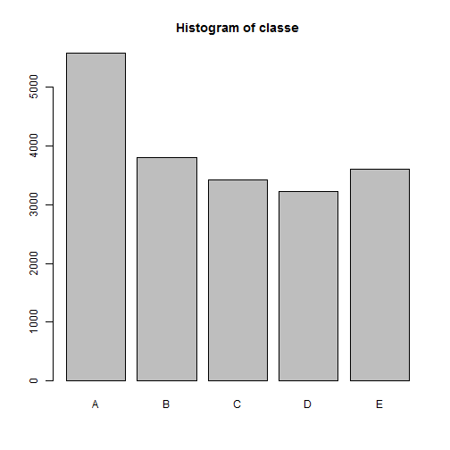
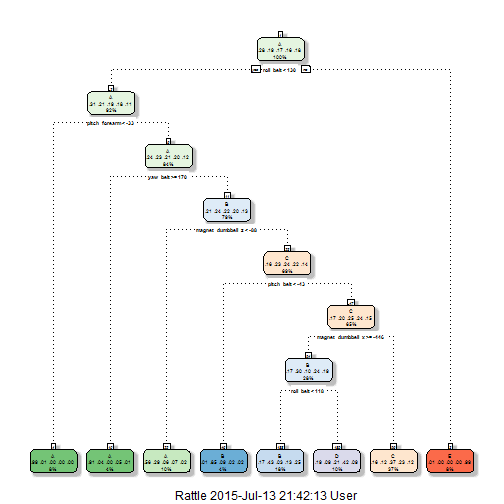

# Introduction
The objective of this report is to predict the type of the activity ("classe") based data from accelerometers on the belt, forearm, arm, and dumbell of 6 participants. 

# Background 
Using devices such as Jawbone Up, Nike FuelBand, and Fitbit it is now possible to collect a large amount of data about personal activity relatively inexpensively. These type of devices are part of the quantified self movement - a group of enthusiasts who take measurements about themselves regularly to improve their health, to find patterns in their behavior, or because they are tech geeks. One thing that people regularly do is quantify how much of a particular activity they do, but they rarely quantify how well they do it. In this project, your goal will be to use data from accelerometers on the belt, forearm, arm, and dumbell of 6 participants. They were asked to perform barbell lifts correctly and incorrectly in 5 different ways. More information is available from the website here: <http://groupware.les.inf.puc-rio.br/har> (see the section on the Weight Lifting Exercise Dataset). 

The data source of this projec is:
Velloso, E.; Bulling, A.; Gellersen, H.; Ugulino, W.; Fuks, H. Qualitative Activity Recognition of Weight Lifting Exercises. Proceedings of 4th International Conference in Cooperation with SIGCHI (Augmented Human '13) . Stuttgart, Germany: ACM SIGCHI, 2013.

Read more: <http://groupware.les.inf.puc-rio.br/har#sbia_paper_section#ixzz3fXJY9q4s>


# Analysis Summary 

* Cleaning the variable: There are 160 variables in the original dataset. However, quite many of them are missing values and irrelavent. I took three steps to clean the data
    + first, remove variables with missing values
    + second, remove "X", time, date, window, and user_name variables, which are not relavent for the prediction
    + third, remove variables which has near zero variance, as these variables does not have prediction power
* Divide the original "training" dataset into training (60\%) and testing (40\%) datasets. 
* Train the three possible models using the training dataset and perform 10-folds cross validataion.
* Perform out of sample test with the testing dataset and pick the best performed model
* Finally, predict variable "classe" for the 20 observations in the orginal "testing" data    

# Analysis and Results
## Read the data

```r
dataURL1 <- "https://d396qusza40orc.cloudfront.net/predmachlearn/pml-training.csv"
dataURL2 <- "https://d396qusza40orc.cloudfront.net/predmachlearn/pml-testing.csv"
training_original <- read.csv(dataURL1, na.strings = c("NA","#DIV/0!",""))
testing_original <- read.csv(dataURL2, na.strings = c("NA","#DIV/0!",""))
```

```r
# show the dimension of the dataset
dim(training_original)
```

```
## [1] 19622   160
```

```r
dim(testing_original)
```

```
## [1]  20 160
```
## Clean the data
In this section, I remove variables with missing values, with near zero variance, and variables which are not relavent for prediction.

### Preprocessing data - 1. delete all the NA variables

```r
MissingVar_train <- ifelse(colSums(is.na(training_original)) > 0, T, F)
sum(MissingVar_train)
```

```
## [1] 100
```

```r
MissingVar_test <- ifelse(colSums(is.na(testing_original)) > 0, T, F)
sum(MissingVar_test)
```

```
## [1] 100
```

```r
# there are 100 variables with missing values

## match training and testing set
s <- data.frame(MissingVar_train, MissingVar_test)
jointMissingVar <- ifelse(rowSums(s) == 0, F, T)
newdataNames <- names(MissingVar_train[which(jointMissingVar == F)])
newdataNames_testing <- newdataNames
newdataNames_testing[60]="problem_id"

training_new <- training_original[newdataNames]
testing_new <- testing_original[newdataNames_testing]
```
### Preprocessing data - 2: several variables are no contribution to the predicion. 

```r
VarNames <- c("X", "user_name", "raw_timestamp_part_1", "raw_timestamp_part_2", "cvtd_timestamp","new_window", "num_window")
training_new <- training_new[-which(names(training_new) %in% VarNames)]
testing_new  <- testing_new[-which(names(testing_new) %in% VarNames)]
```
### Preprocessing data - 3: delete near zero covariance variables

```r
library(caret)
```

```
## Loading required package: lattice
## Loading required package: ggplot2
```

```r
nsv_train <- nearZeroVar(training_new, saveMetric = T)
nsv_test <- nearZeroVar(training_new, saveMetric = T)
```


```
## [1] "there is 0 missing variable in the training set"
```

```
## [1] "there is 0 missing variable in the testing set"
```

```
## [1] "there is 0 near zero variance variable in the training set"
```

```
## [1] "there is 0 near zero variance variable in the testing set"
```

There are 53 variables are selcted in the end. The following graph shows a distribution of variable "classe".

```r
plot(training_new$classe, main = "Histogram of classe")
```

 

## Create the training and testing set
In this section, I seperate the original "training" data into training (60\%) and testing (40\%) datasets. I will train the 


```r
# creating training and testing set in the original training set
library(rpart)
set.seed(12233)
inTrain  <- createDataPartition(y=training_new$classe, p=0.6, list=F)
training <- training_new[inTrain,]
testing  <- training_new[-inTrain,]
rbind(dim(training_new), dim(training), dim(testing))
```

```
##       [,1] [,2]
## [1,] 19622   53
## [2,] 11776   53
## [3,]  7846   53
```
## Models training
To train the model with the training set, I perform a 10 - folds cross validation. First set a genearl "train_control", this variable can be used in all the models.

```r
# choose 10 folds cross validation
# define training control
train_control <- trainControl(method="cv", number=10)
```
### Model 1 - random forest
A random forest model is first performed with the 10 - folds cross validataion. I then use the testing dataset to test the out of sample error

```r
# train the model 
set.seed(12233)
Mod_RF <- train(classe~., data = training, trControl=train_control, method = 'rf')
Pre_RF <- predict(Mod_RF, testing)
```

```r
# out of sample error
confusionMatrix(Pre_RF, testing$classe)
```

```
## Confusion Matrix and Statistics
## 
##           Reference
## Prediction    A    B    C    D    E
##          A 2222   12    0    0    0
##          B    4 1499    8    3    0
##          C    2    4 1353   12    4
##          D    3    3    7 1269    3
##          E    1    0    0    2 1435
## 
## Overall Statistics
##                                          
##                Accuracy : 0.9913         
##                  95% CI : (0.989, 0.9933)
##     No Information Rate : 0.2845         
##     P-Value [Acc > NIR] : < 2.2e-16      
##                                          
##                   Kappa : 0.989          
##  Mcnemar's Test P-Value : NA             
## 
## Statistics by Class:
## 
##                      Class: A Class: B Class: C Class: D Class: E
## Sensitivity            0.9955   0.9875   0.9890   0.9868   0.9951
## Specificity            0.9979   0.9976   0.9966   0.9976   0.9995
## Pos Pred Value         0.9946   0.9901   0.9840   0.9875   0.9979
## Neg Pred Value         0.9982   0.9970   0.9977   0.9974   0.9989
## Prevalence             0.2845   0.1935   0.1744   0.1639   0.1838
## Detection Rate         0.2832   0.1911   0.1724   0.1617   0.1829
## Detection Prevalence   0.2847   0.1930   0.1752   0.1638   0.1833
## Balanced Accuracy      0.9967   0.9926   0.9928   0.9922   0.9973
```

### Model 2 - classification Tree
Second, I choose a classification tree with 10 - folds cross validation. The decision tree is shown and the out of sample predcition error is calculated


```r
set.seed(12233)
Mod_CT <- train(classe~., method = "rpart", data= training, trControl=train_control)
Pre_CT <- predict(Mod_CT, testing)
```

```r
# out of sample error
library(rattle)
fancyRpartPlot(Mod_CT$finalModel)
```

 

```r
confusionMatrix(Pre_CT, testing$classe)
```

```
## Confusion Matrix and Statistics
## 
##           Reference
## Prediction    A    B    C    D    E
##          A 1392  258   31   72   25
##          B  230  858   63  191  347
##          C  466  331 1088  677  331
##          D  140   71  186  346   84
##          E    4    0    0    0  655
## 
## Overall Statistics
##                                           
##                Accuracy : 0.553           
##                  95% CI : (0.5419, 0.5641)
##     No Information Rate : 0.2845          
##     P-Value [Acc > NIR] : < 2.2e-16       
##                                           
##                   Kappa : 0.4391          
##  Mcnemar's Test P-Value : < 2.2e-16       
## 
## Statistics by Class:
## 
##                      Class: A Class: B Class: C Class: D Class: E
## Sensitivity            0.6237   0.5652   0.7953   0.2691  0.45423
## Specificity            0.9312   0.8687   0.7214   0.9267  0.99938
## Pos Pred Value         0.7829   0.5080   0.3761   0.4184  0.99393
## Neg Pred Value         0.8616   0.8928   0.9435   0.8661  0.89050
## Prevalence             0.2845   0.1935   0.1744   0.1639  0.18379
## Detection Rate         0.1774   0.1094   0.1387   0.0441  0.08348
## Detection Prevalence   0.2266   0.2153   0.3687   0.1054  0.08399
## Balanced Accuracy      0.7774   0.7169   0.7583   0.5979  0.72680
```

### Model 3- Boosting
Last, I try the boosting method with 10 - folds cross validataion. The out of sample prediction error is calculated with the testing dataset 


```r
set.seed(12233)
Mod_Bo <- train(classe~., data = training, trControl=train_control, method = 'gbm')
Pre_Bo <- predict(Mod_Bo, testing)
```


```r
# out of sample error
confusionMatrix(Pre_Bo, testing$classe)
```

```
## Confusion Matrix and Statistics
## 
##           Reference
## Prediction    A    B    C    D    E
##          A 2187   57    0    2    2
##          B   26 1425   40    5   13
##          C    7   33 1310   37   11
##          D   11    3   18 1238   21
##          E    1    0    0    4 1395
## 
## Overall Statistics
##                                          
##                Accuracy : 0.9629         
##                  95% CI : (0.9585, 0.967)
##     No Information Rate : 0.2845         
##     P-Value [Acc > NIR] : < 2.2e-16      
##                                          
##                   Kappa : 0.9531         
##  Mcnemar's Test P-Value : 8.873e-11      
## 
## Statistics by Class:
## 
##                      Class: A Class: B Class: C Class: D Class: E
## Sensitivity            0.9798   0.9387   0.9576   0.9627   0.9674
## Specificity            0.9891   0.9867   0.9864   0.9919   0.9992
## Pos Pred Value         0.9729   0.9443   0.9371   0.9589   0.9964
## Neg Pred Value         0.9920   0.9853   0.9910   0.9927   0.9927
## Prevalence             0.2845   0.1935   0.1744   0.1639   0.1838
## Detection Rate         0.2787   0.1816   0.1670   0.1578   0.1778
## Detection Prevalence   0.2865   0.1923   0.1782   0.1645   0.1784
## Balanced Accuracy      0.9845   0.9627   0.9720   0.9773   0.9833
```

# Predicion 
Based on the model training, both random forest model and boosting model has very high prediction power. The out of sample accuracy is 0.9913 for the random forest and 0.9629 for boosting method, whereas, randome forest is more accurate. Therefore, I use both method to predict the "classe" type for the 20 observations in the original testing data. As seen, they provide the same forecasts for the 20 testing observations


```r
predict(Mod_RF, testing_new)
```

```
##  [1] B A B A A E D B A A B C B A E E A B B B
## Levels: A B C D E
```

```r
predict(Mod_Bo, testing_new)
```

```
##  [1] B A B A A E D B A A B C B A E E A B B B
## Levels: A B C D E
```
